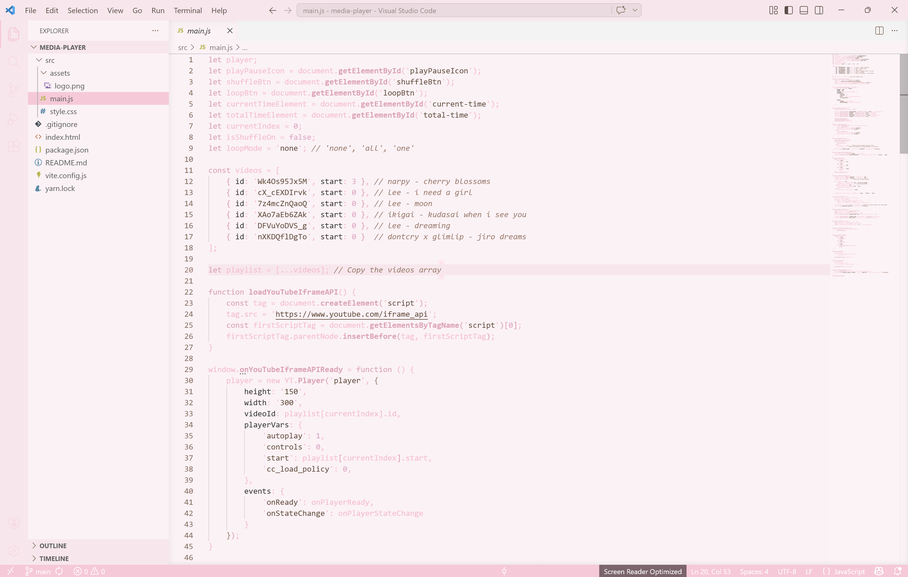

# Light Pink Theme 🌸

*A soft light pink VS Code theme made by nini.ഒ*

## 🖼️ Preview

## 🎨 Color Palette

| Element | Color | Hex |
|---------|-------|-----|
| Background | Light Rose | `#fdf2f6` |
| Main | Soft Rose | `#FAE6EC` |
| Accent | Soft Pink | `#ffe5ed` |
| Highlight | Gentle Rose | `#ffc7d8` |
| Icons | Mauve Pink | `#ffd6e2` |
| Primary Brown | Warm Brown | `#8B6F5F` |
| Secondary Brown | Rose Brown | `#a07a6b` |
| Dark Brown | Deep Brown | `#5c4f47` |

## 📦 Installation

### From VS Code Marketplace
1. Open Visual Studio Code
2. Go to the Extensions view (Ctrl+Shift+X / Cmd+Shift+X)
3. Search for "Light Pink"
4. Click **Install**

### Activate the Theme
1. Go to File → Preferences → Color Theme (or Ctrl+K Ctrl+T)
2. Select "Light Pink by nini.ഒ" from the list
3. Enjoy! 💕

---

*Made with whimsical energy by nini..ഒ*
